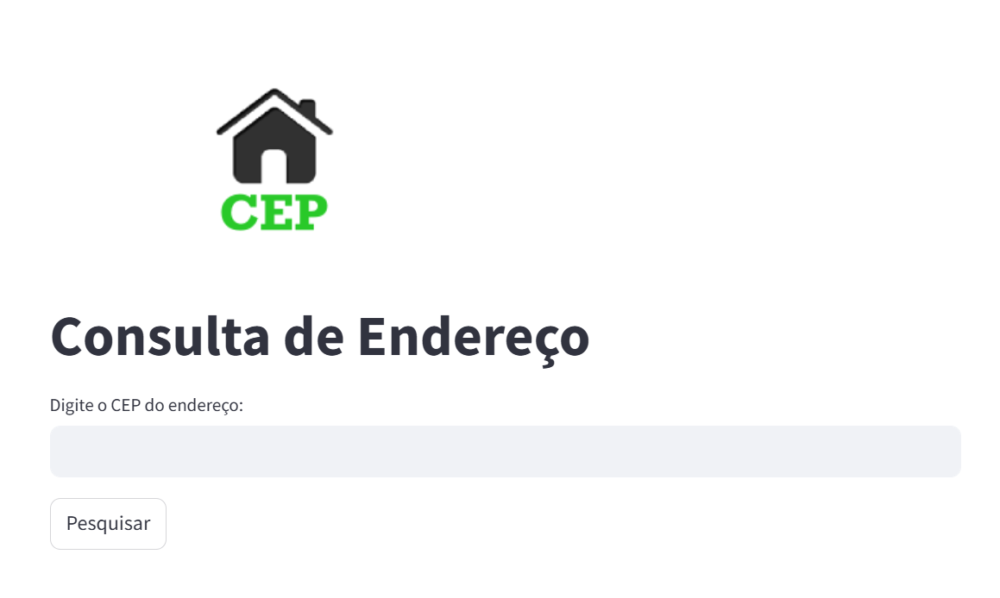

# Projeto de Estudo: Consulta de Endereço com API ViaCEP e Streamlit

Este projeto demonstra, de forma simples e didática, como utilizar as bibliotecas `requests` e `streamlit` em Python para consumir a API pública **ViaCEP**, dos Correios, e exibir os dados de endereço com base em um CEP informado.

## 💡 Objetivo

Criar uma aplicação leve para fins de estudo e portfólio, com os seguintes propósitos:

- Consumir a API [ViaCEP](https://viacep.com.br/) utilizando a biblioteca `requests`;
- Exibir as informações obtidas em uma interface interativa com `streamlit`;
- Servir como exemplo prático de integração com API REST utilizando Python moderno e boas práticas de gerenciamento de dependências com Poetry.

## 🔧 Tecnologias utilizadas

- [Python 3.9+](https://www.python.org/)
- [Requests](https://docs.python-requests.org/)
- [Streamlit](https://streamlit.io/)
- [Poetry](https://python-poetry.org/)
- [API ViaCEP](https://viacep.com.br/)

## 🚀 Como executar o projeto

1. Clone este repositório:

```bash
git clone https://github.com/seuusuario/nome-do-repositorio.git
cd nome-do-repositorio
```

2. Instale o Poetry (caso ainda não tenha):

```bash
pip install poetry
```

3. Instale as dependências do projeto com o Poetry:

```bash
poetry install
```

4. Ative o ambiente virtual gerenciado pelo Poetry:

```bash
poetry env activate
```

5. Execute a aplicação com Streamlit:

```bash
streamlit run app.py
```

## 🧪 Exemplo de uso

A aplicação permite ao usuário digitar um **CEP válido** e visualizar:

- Logradouro
- Bairro
- Cidade
- Estado
- Código IBGE (quando disponível)

As informações são obtidas em tempo real da API pública dos Correios (ViaCEP).

## 📂 Estrutura do projeto

```
.
├── app.py                # Código principal da aplicação
├── pyproject.toml        # Configuração do Poetry e dependências
├── poetry.lock           # Arquivo de bloqueio gerado automaticamente
└── README.md             # Este arquivo
```



## 🧑‍💻 Autor

Desenvolvido por [Paulo Brasiliense](https://github.com/PauloBrasiliense) como projeto de estudo e demonstração prática para portfólio.

---